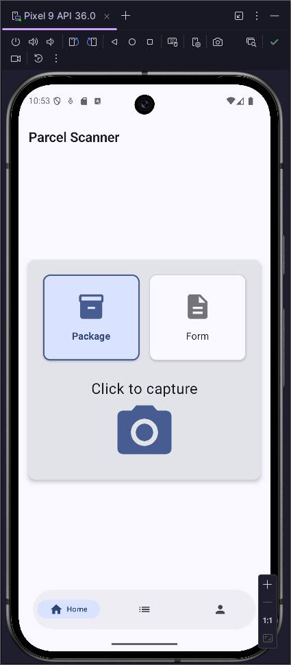
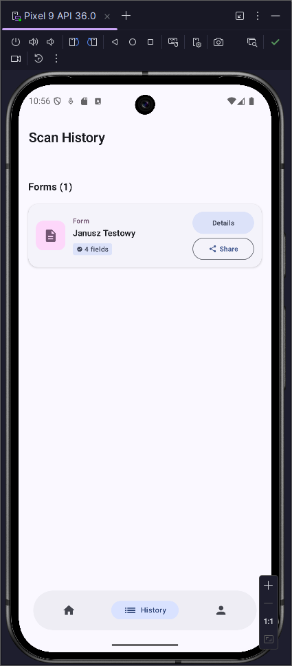
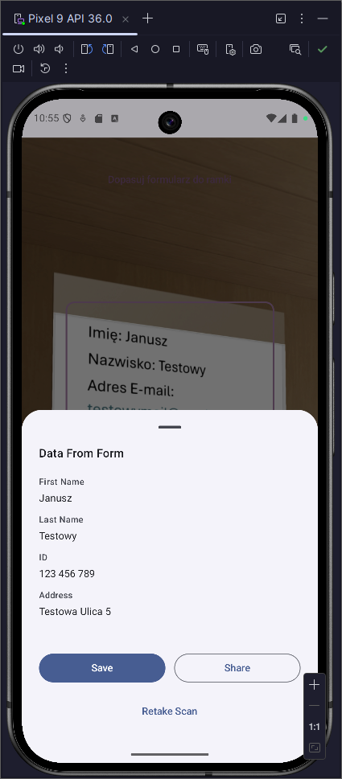

📦 Parcel Scanner Sim
Aplikacja Android stworzona w Jetpack Compose z wykorzystaniem architektury MVVM, przeznaczona dla małych wysyłkowni paczek.

## Opis
- Aplikacja umożliwia szybkie i wygodne skanowanie kodów kreskowych z paczek oraz formularzy przy użyciu ML Kit (Google). Usprawnia proces obsługi przesyłek, minimalizując błędy i przyspieszając pracę.

## Funkcjonalności
- 📷 Skanowanie kodów kreskowych w czasie rzeczywistym
- 🧾 Obsługa paczek i formularzy
- ⚡ Szybkie przetwarzanie danych dzięki ML Kit
-🧩 Przejrzysty interfejs w Jetpack Compose
-🔄 Architektura MVVM zapewniająca skalowalność i łatwość utrzymania

## 🛠️ Technologie
- Kotlin
- Jetpack Compose
- MVVM
- ML Kit (Barcode Scanning)
-CameraX

## 📷 Screenshots:
  

  
  
  

